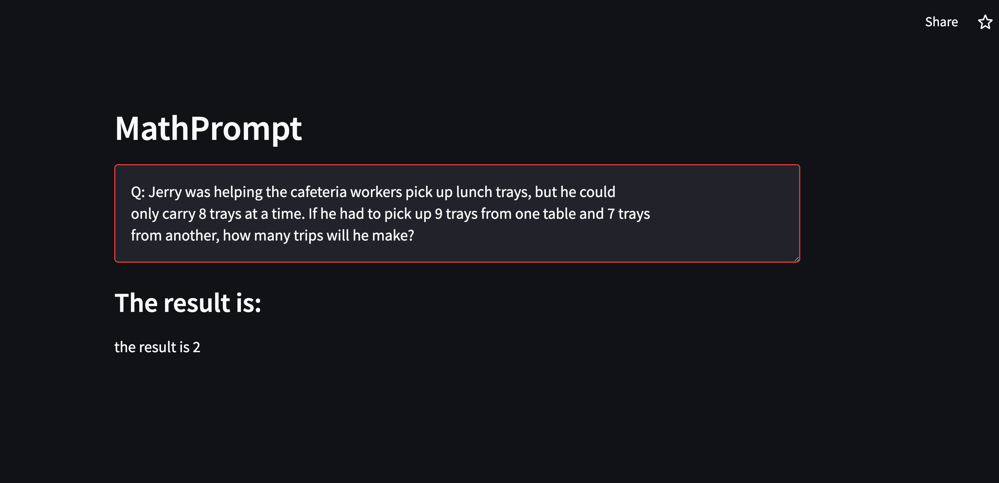

# A simple implementation for MathPrompter

You can visit the demo website [Here](https://delveintodetail-mathprompter-main1-xdn3b9.streamlit.app/)

## A demo screemshot

This demo is not a strict implementation of the MathPrompter, it is only a demo for fun. To build this demo, I use LangChain, Streamlit and OpenAI API.

### Reference:

[1] Imani, Shima, Liang Du, and Harsh Shrivastava. "MathPrompter: Mathematical Reasoning using Large Language Models." arXiv preprint arXiv:2303.05398 (2023).
